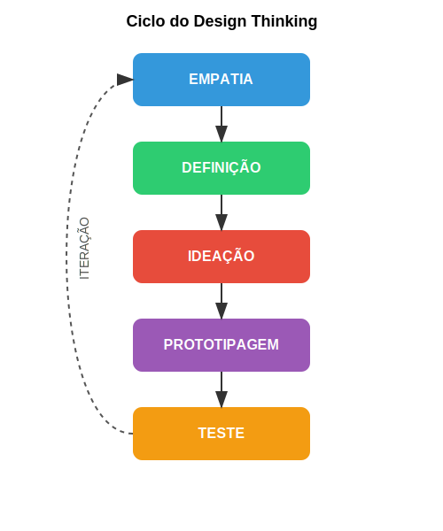

**3. Experimentação:** O Design Thinking abraça a experimentação rápida e iterativa como caminho para a inovação. Este princípio se baseia na ideia de que é mais eficiente testar conceitos iniciais e imperfeitos do que tentar alcançar a perfeição antes do primeiro teste. A experimentação permite aprendizados rápidos e ajustes contínuos, reduzindo riscos e aumentando as chances de sucesso. Protótipos simples e de baixa fidelidade são ferramentas essenciais neste processo, permitindo que ideias abstratas ganhem forma tangível e possam ser avaliadas por usuários reais.

**4. Iteração:** Intimamente ligada à experimentação, a iteração reconhece que o processo de design raramente é linear. Ao contrário, é um ciclo contínuo de observação, ideação, prototipagem, teste e refinamento. Cada ciclo gera aprendizados que informam o próximo, em um processo de melhoria contínua. A iteração permite que as soluções evoluam organicamente, incorporando feedbacks e se adaptando às necessidades emergentes dos usuários e às mudanças no contexto.

Estes quatro princípios não operam isoladamente, mas se entrelaçam e se reforçam mutuamente. A empatia alimenta a colaboração ao trazer perspectivas diversas; a colaboração enriquece a experimentação ao combinar diferentes habilidades e conhecimentos; a experimentação acelera a iteração ao gerar dados concretos; e a iteração aprofunda a empatia ao revelar novas nuances sobre as necessidades dos usuários.

## Benefícios para Startups Deeptech

As startups de base tecnológica profunda (deeptech) enfrentam desafios únicos que tornam o Design Thinking particularmente valioso em seu contexto. Estas empresas geralmente desenvolvem inovações baseadas em avanços científicos significativos ou engenharia de alta complexidade, como inteligência artificial, biotecnologia, nanotecnologia ou computação quântica. Neste cenário, o Design Thinking oferece benefícios estratégicos:

**Humanização da tecnologia complexa:** Startups deeptech frequentemente lidam com tecnologias altamente complexas e abstratas. O Design Thinking ajuda a traduzir essa complexidade em soluções compreensíveis e desejáveis para os usuários finais, criando pontes entre o avanço tecnológico e as necessidades humanas reais. Ao focar nas pessoas antes da tecnologia, evita-se o desenvolvimento de soluções tecnicamente impressionantes, mas sem aplicação prática ou apelo de mercado.

**Redução de riscos em ambientes de alta incerteza:** O desenvolvimento de tecnologias profundas envolve investimentos substanciais e longos ciclos de desenvolvimento, amplificando os riscos. A abordagem iterativa e experimental do Design Thinking permite validar premissas críticas de negócio e tecnologia em estágios iniciais, antes de grandes comprometimentos de recursos. Protótipos simples podem testar conceitos fundamentais e gerar aprendizados valiosos a custos relativamente baixos.

**Alinhamento entre inovação tecnológica e necessidades de mercado:** Muitas startups deeptech nascem de descobertas científicas ou avanços tecnológicos buscando aplicações comerciais. O Design Thinking inverte essa lógica, partindo das necessidades não atendidas dos usuários para então aplicar a tecnologia como solução. Esta inversão aumenta significativamente as chances de desenvolver produtos que encontrem receptividade no mercado.

**Comunicação eficaz com stakeholders diversos:** Startups deeptech precisam comunicar propostas complexas para audiências variadas - desde investidores e parceiros até clientes potenciais e reguladores. O Design Thinking, com sua ênfase em visualização e prototipagem, fornece ferramentas poderosas para tornar conceitos abstratos mais tangíveis e compreensíveis para diferentes públicos.

**Cultura de inovação sustentável:** O Design Thinking não é apenas um conjunto de métodos, mas uma mentalidade que, quando incorporada à cultura organizacional, cria um ambiente propício à inovação contínua. Para startups deeptech, que precisam manter sua vantagem competitiva em mercados dinâmicos, esta cultura representa um ativo estratégico valioso.

A aplicação do Design Thinking em startups deeptech não está isenta de desafios. A necessidade de equilibrar o rigor científico com a flexibilidade criativa, ou de conciliar ciclos de desenvolvimento tecnológico longos com a agilidade do design centrado no usuário, exige adaptações metodológicas. No entanto, quando implementado com sensibilidade a estas particularidades, o Design Thinking pode ser um diferencial competitivo significativo, aumentando as chances de que inovações tecnológicas profundas se traduzam em produtos bem-sucedidos e impactos positivos na sociedade.

A imagem acima ilustra o conceito fundamental do Design Thinking como um processo centrado no ser humano, iterativo e não-linear, onde cada fase se conecta organicamente com as demais, permitindo retornos e avanços conforme necessário para alcançar soluções verdadeiramente inovadoras e alinhadas às necessidades dos usuários.

---

← [Anterior](./1.1.1_conceitos_basicos_parte1.md) | [Sumário](../../sumario.md) | [Próximo](./1.1.2_etapas_design_thinking_parte1.md) →