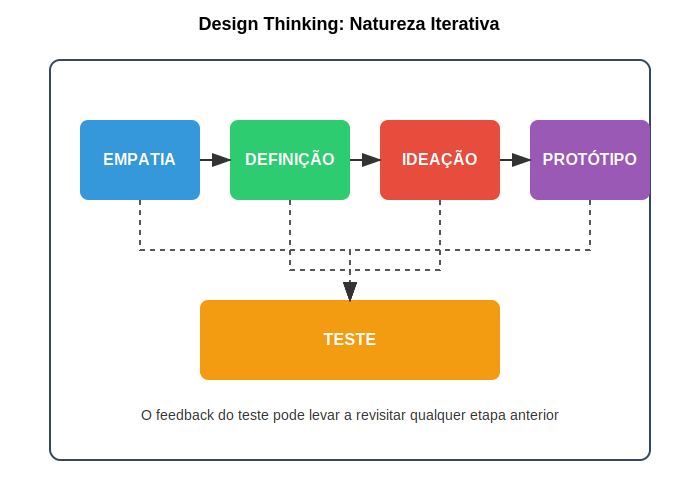

## Definição: Síntese e Formulação de Problemas

A fase de definição representa o momento de convergência após a ampla exploração realizada na fase de empatia. Nesta etapa, os dados e observações coletados são analisados, interpretados e sintetizados para formular uma compreensão clara do problema a ser resolvido. O objetivo principal é transformar insights dispersos em um desafio de design claro, acionável e centrado no usuário.

### Técnicas e Objetivos da Fase de Definição

A definição eficaz do problema requer técnicas que ajudem a organizar, priorizar e comunicar os insights obtidos na fase de empatia:

**Mapeamento de insights:** Organização visual das descobertas da pesquisa, identificando padrões, contradições e oportunidades. Técnicas como mapas de afinidade, onde observações similares são agrupadas, ajudam a identificar temas emergentes nos dados.

**Personas:** Representações arquetípicas dos usuários baseadas em dados reais, que humanizam e condensam as descobertas da pesquisa. As personas capturam não apenas dados demográficos, mas também comportamentos, motivações, frustrações e objetivos dos usuários.

**Jornadas do usuário:** Visualizações do processo completo que os usuários percorrem ao interagir com um produto ou serviço, destacando pontos de contato, emoções e oportunidades de melhoria. Estas jornadas revelam momentos críticos onde intervenções de design podem gerar maior impacto.

**Declarações de problema (Problem Statements):** Articulações concisas do desafio a ser abordado, geralmente estruturadas como "Como poderíamos..." (How Might We). Estas declarações enquadram o problema de forma que convida à exploração criativa de soluções, sem restringir prematuramente o espaço de possibilidades.

**Definição de critérios de sucesso:** Estabelecimento de parâmetros claros para avaliar potenciais soluções, garantindo alinhamento com as necessidades dos usuários e objetivos do projeto.

A qualidade da definição do problema determina em grande medida o sucesso das fases subsequentes. Um problema bem definido direciona a criatividade para onde ela pode gerar maior valor, enquanto um problema mal definido pode levar a soluções elegantes para desafios irrelevantes. Como observou o cientista Albert Einstein: "Se eu tivesse uma hora para resolver um problema, gastaria 55 minutos pensando sobre o problema e 5 minutos pensando em soluções."

Para startups deeptech, a fase de definição é particularmente crítica, pois ajuda a traduzir possibilidades tecnológicas amplas em aplicações específicas que atendem a necessidades reais. Muitas vezes, a tecnologia desenvolvida por estas startups pode resolver múltiplos problemas, e a definição clara ajuda a priorizar os casos de uso com maior potencial de impacto e viabilidade comercial.

## Ideação: Geração e Seleção de Ideias

A fase de ideação marca o início do espaço de solução, onde a criatividade é aplicada ao problema definido para gerar um amplo espectro de possíveis abordagens. Esta etapa caracteriza-se pela divergência deliberada, buscando quantidade e diversidade de ideias antes de convergir para as mais promissoras.

### Técnicas e Objetivos da Fase de Ideação

A ideação eficaz equilibra liberdade criativa com direcionamento estratégico, empregando técnicas que estimulam o pensamento lateral e rompem padrões estabelecidos:

**Brainstorming estruturado:** Sessões colaborativas para geração rápida de ideias, seguindo princípios como "adiar o julgamento", "buscar quantidade", "construir sobre ideias dos outros" e "encorajar ideias não convencionais". Variações como brainwriting (ideias escritas) podem ajudar a garantir participação equitativa.

**Técnicas de pensamento lateral:** Métodos como SCAMPER (Substituir, Combinar, Adaptar, Modificar, Propor outros usos, Eliminar, Rearranjar) que fornecem provocações específicas para estimular novas perspectivas sobre o problema.

**Analogias e biomimética:** Busca de inspiração em domínios não relacionados ou na natureza, identificando como desafios similares são resolvidos em outros contextos e adaptando essas soluções ao problema em questão.

**Bodystorming:** Encenação física de cenários para gerar ideias através da experiência corporal, particularmente útil para produtos ou serviços com forte componente de interação física.

**Técnicas de visualização:** Métodos como esboços rápidos, storyboards e mapas conceituais que ajudam a externalizar e comunicar ideias abstratas, facilitando sua evolução colaborativa.

Após a geração abundante de ideias, a fase de ideação também inclui processos de seleção e refinamento, como votação, matriz de decisão ou prototipagem rápida de conceitos, para identificar as ideias mais promissoras a serem desenvolvidas na fase seguinte.

Para startups deeptech, a ideação deve equilibrar a exploração criativa com as restrições tecnológicas e científicas relevantes. Equipes multidisciplinares que combinam especialistas técnicos com designers e profissionais de negócios tendem a gerar soluções mais viáveis e inovadoras, integrando possibilidades tecnológicas com necessidades de mercado.

A imagem acima ilustra a natureza iterativa do processo de Design Thinking, demonstrando como as diferentes etapas se conectam e se retroalimentam, permitindo refinamentos contínuos baseados em aprendizados e feedbacks ao longo do desenvolvimento da solução.

---

← [Anterior](./1.1.2_etapas_design_thinking_parte1.md) | [Sumário](../../sumario.md) | [Próximo](./1.1.2_etapas_design_thinking_parte3.md) →