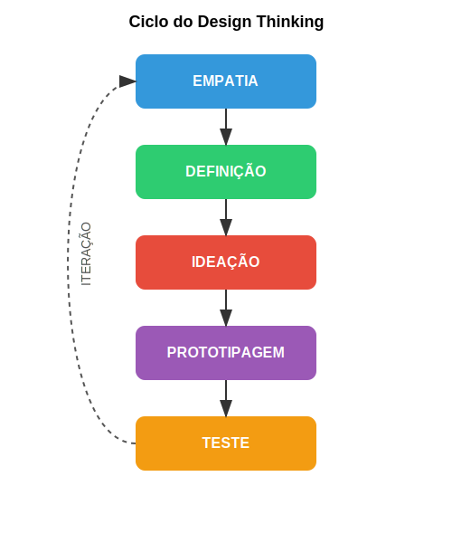

## Prototipagem: Tipos e Níveis de Fidelidade

A fase de prototipagem transforma ideias abstratas em representações tangíveis que podem ser experimentadas, testadas e refinadas. Os protótipos servem como ferramentas de pensamento e comunicação, permitindo explorar conceitos de forma concreta antes de investimentos significativos em desenvolvimento.

### Técnicas e Objetivos da Fase de Prototipagem

A prototipagem eficaz seleciona o nível de fidelidade e a técnica apropriada para responder às questões mais críticas no estágio atual do projeto:

**Protótipos de baixa fidelidade:** Representações simples e rápidas de conceitos, como esboços em papel, storyboards ou maquetes rudimentares. Estes protótipos são ideais para estágios iniciais, quando múltiplas direções precisam ser exploradas com investimento mínimo. Sua simplicidade deliberada convida ao feedback honesto, pois os usuários entendem que o conceito ainda está em formação.

**Protótipos de média fidelidade:** Representações mais elaboradas que capturam aspectos funcionais ou estéticos específicos da solução, como wireframes interativos para interfaces digitais ou modelos físicos parcialmente funcionais. Estes protótipos permitem testar componentes críticos da solução de forma isolada.

**Protótipos de alta fidelidade:** Representações refinadas que se aproximam da experiência final em aparência e funcionalidade. Embora mais custosos e demorados para produzir, estes protótipos são valiosos para validação final de conceitos e comunicação com stakeholders que podem ter dificuldade em visualizar o produto a partir de representações mais abstratas.

**Prototipagem modular:** Abordagem que divide a solução em componentes que podem ser prototipados e testados separadamente, permitindo foco em áreas de maior incerteza ou risco.

**Prototipagem "Mágico de Oz":** Técnica onde a funcionalidade é simulada por operadores humanos nos bastidores, permitindo testar experiências complexas (como interações com inteligência artificial) antes do desenvolvimento técnico completo.

O objetivo principal da prototipagem não é criar uma versão preliminar do produto final, mas sim gerar aprendizados rápidos e de baixo custo. Cada protótipo deve ser projetado para responder perguntas específicas, como "Esta interface é compreensível para os usuários?" ou "Este mecanismo físico funciona conforme esperado?".

Para startups deeptech, a prototipagem apresenta desafios particulares devido à complexidade tecnológica envolvida. Frequentemente, é necessário desenvolver "protótipos de conceito" que demonstram princípios científicos fundamentais antes de avançar para protótipos da solução completa. Técnicas como simulações computacionais, visualizações de dados ou demonstrações de componentes críticos podem ser particularmente valiosas neste contexto.

## Teste: Métodos e Métricas

A fase de teste completa o ciclo inicial do Design Thinking, colocando protótipos diante de usuários reais para obter feedback, validar hipóteses e identificar oportunidades de refinamento. Esta etapa gera os insights que alimentam novas iterações do processo, em um ciclo contínuo de melhoria.

### Técnicas e Objetivos da Fase de Teste

O teste eficaz combina métodos qualitativos e quantitativos, adaptados ao estágio do projeto e às questões específicas a serem respondidas:

**Testes de usabilidade:** Observação estruturada de usuários interagindo com protótipos para completar tarefas específicas, identificando pontos de confusão, erros e oportunidades de melhoria. Técnicas como "pensar em voz alta" (think-aloud protocol) revelam o raciocínio dos usuários durante a interação.

**Entrevistas pós-uso:** Conversas estruturadas após a interação com o protótipo, explorando percepções, satisfação e sugestões dos usuários. Estas entrevistas podem revelar aspectos emocionais e subjetivos da experiência que não são evidentes apenas pela observação.

**Testes A/B:** Comparação sistemática entre diferentes versões de um elemento específico para determinar qual gera melhores resultados. Esta técnica é particularmente valiosa para decisões de design baseadas em dados quando existem alternativas viáveis.

**Avaliação heurística:** Análise sistemática do protótipo por especialistas, utilizando princípios estabelecidos de design e usabilidade. Esta técnica complementa o feedback dos usuários com perspectivas baseadas em conhecimento especializado.

**Métricas de desempenho:** Medidas quantitativas como tempo para completar tarefas, taxa de erro ou eficiência de uso, que fornecem dados objetivos sobre aspectos específicos da experiência do usuário.

O objetivo principal da fase de teste não é validar que o protótipo está "correto", mas sim identificar oportunidades de melhoria e gerar insights para a próxima iteração. Uma mentalidade de curiosidade genuína e abertura ao feedback, mesmo quando desafiador, é essencial para extrair o máximo valor desta fase.

Para startups deeptech, os testes frequentemente precisam avaliar não apenas a experiência do usuário, mas também a viabilidade técnica e o desempenho da tecnologia em condições reais. Testes de campo, pilotos controlados e validações técnicas específicas podem ser necessários além dos métodos tradicionais de teste centrados no usuário.

A imagem acima ilustra o ciclo completo do Design Thinking, destacando a natureza interconectada das cinco etapas: Empatia, Definição, Ideação, Prototipagem e Teste. Este ciclo não representa um processo linear, mas sim um sistema dinâmico onde cada fase informa e enriquece as demais, permitindo múltiplas iterações em busca de soluções cada vez mais refinadas e alinhadas às necessidades dos usuários.

---

← [Anterior](./1.1.2_etapas_design_thinking_parte2.md) | [Sumário](../../sumario.md) | [Próximo](./1.1.3_cases_rapidos_identificao_de_problemas.md) →