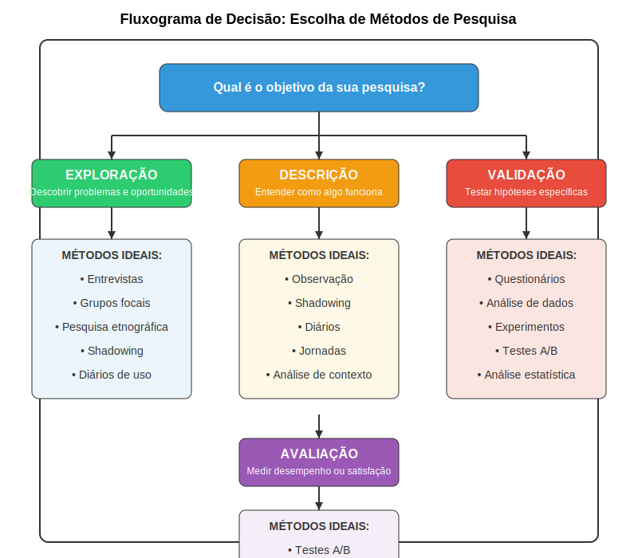

### Analytics e Métricas de Uso

Analytics e métricas de uso permitem coletar dados objetivos sobre como os usuários interagem com produtos ou serviços digitais em escala. Estes métodos são particularmente valiosos para identificar padrões de comportamento real (em oposição a comportamento auto-relatado) e quantificar aspectos específicos da experiência do usuário.

**Quando utilizar:**
- Para medir comportamentos reais em produtos existentes
- Para identificar padrões de uso e pontos de abandono
- Para testar hipóteses específicas com dados objetivos
- Para monitorar o impacto de mudanças de design ao longo do tempo

**Técnicas específicas:**
- **Web/app analytics:** Coleta de dados sobre navegação, cliques, tempo de permanência e conversões.
- **Heatmaps e mapas de clique:** Visualizações que mostram onde os usuários focam atenção ou interagem.
- **Funis de conversão:** Análise de como os usuários progridem através de sequências de ações desejadas.
- **Métricas de engajamento:** Medidas de frequência, duração e profundidade de uso.

Para startups deeptech, analytics podem ser particularmente úteis para compreender como usuários técnicos exploram funcionalidades avançadas e identificar quais aspectos da tecnologia geram maior valor em uso real.

### Testes A/B e Experimentação

Testes A/B e outras formas de experimentação controlada permitem comparar sistematicamente diferentes versões de um elemento específico para determinar qual gera melhores resultados. Estes métodos são ideais para tomar decisões de design baseadas em dados quando existem alternativas viáveis.

**Quando utilizar:**
- Para comparar alternativas específicas de design
- Para otimizar elementos críticos da experiência
- Para validar hipóteses com dados comportamentais
- Quando existem métricas claras de sucesso

**Técnicas específicas:**
- **Testes A/B clássicos:** Comparação entre duas versões, com usuários aleatoriamente direcionados para cada uma.
- **Testes multivariados:** Testam múltiplas variáveis simultaneamente para identificar combinações ótimas.
- **Rollouts graduais:** Implementação progressiva de mudanças, monitorando impacto em cada fase.
- **Bandits algorithms:** Métodos adaptativos que otimizam a alocação de usuários entre variantes durante o teste.

Para startups deeptech, experimentação controlada pode ser valiosa para refinar aspectos específicos da interface sem comprometer a robustez técnica subjacente, permitindo otimização contínua baseada em dados reais de uso.

## Pesquisa Desk: Fontes e Técnicas

A pesquisa desk (ou pesquisa secundária) envolve a coleta e análise de informações existentes, em contraste com a pesquisa primária que gera novos dados. Este método é frequentemente subestimado, mas pode fornecer insights valiosos com investimento relativamente baixo de recursos.

**Quando utilizar:**
- Para compreender o contexto mais amplo do problema
- Para identificar tendências e padrões estabelecidos
- Para aprender com sucessos e fracassos anteriores
- Como preparação para pesquisa primária mais focada

**Fontes relevantes:**
- **Literatura científica:** Artigos acadêmicos e publicações de pesquisa.
- **Relatórios de mercado:** Análises de tendências, tamanho de mercado e comportamento do consumidor.
- **Patentes e publicações técnicas:** Documentação de soluções existentes e direções tecnológicas.
- **Fóruns e comunidades online:** Discussões espontâneas entre usuários sobre necessidades e problemas.
- **Análise competitiva:** Estudo de soluções existentes e feedback de seus usuários.

Para startups deeptech, a pesquisa desk é particularmente valiosa para mapear o panorama tecnológico, identificar lacunas em soluções existentes e compreender o contexto regulatório e de mercado antes de investir em desenvolvimento técnico significativo.

A imagem acima apresenta um fluxograma para auxiliar na escolha dos métodos de pesquisa mais adequados com base nos objetivos específicos, recursos disponíveis e estágio do projeto. Esta ferramenta pode ajudar startups deeptech a selecionar abordagens eficientes para cada fase de desenvolvimento.

## Quando Usar Cada Método

A seleção dos métodos mais apropriados depende de diversos fatores, incluindo os objetivos específicos da pesquisa, o estágio do projeto, os recursos disponíveis e as características dos usuários a serem estudados.

### Critérios de Seleção

**Objetivos da pesquisa:**
- Para exploração inicial e descoberta: Métodos qualitativos como entrevistas e observação
- Para validação e quantificação: Métodos quantitativos como surveys e analytics
- Para otimização de elementos específicos: Testes A/B e experimentação

**Estágio do projeto:**
- Fase de empatia: Entrevistas em profundidade, observação, pesquisa desk
- Fase de definição: Grupos focais, análise de dados qualitativos
- Fase de ideação: Workshops de co-criação, testes de conceito
- Fase de prototipagem e teste: Testes de usabilidade, testes A/B

**Recursos disponíveis:**
- Tempo limitado: Pesquisa desk, surveys online, analytics
- Orçamento restrito: Entrevistas remotas, diários, análise de dados existentes
- Acesso limitado aos usuários: Pesquisa desk, análise competitiva, métodos assíncronos

**Características dos usuários:**
- Usuários técnicos: Entrevistas em profundidade, observação contextual, diários
- Usuários dispersos geograficamente: Surveys online, entrevistas remotas, analytics
- Usuários em contextos específicos: Observação in loco, shadowing, estudos contextuais

### Abordagem Mista: Triangulação de Métodos

Na prática, a abordagem mais robusta frequentemente envolve a combinação de múltiplos métodos complementares, um conceito conhecido como "triangulação". Esta estratégia permite compensar as limitações inerentes a cada método individual e construir uma compreensão mais completa e confiável.

Exemplos de triangulação eficaz para startups deeptech:
- Combinar entrevistas em profundidade (para compreender motivações) com analytics (para medir comportamentos reais)
- Complementar observação contextual (para identificar problemas) com surveys (para quantificar sua prevalência)
- Integrar pesquisa desk (para contexto amplo) com grupos focais (para insights específicos do segmento-alvo)

A triangulação não apenas aumenta a confiabilidade dos insights, mas também frequentemente revela contradições produtivas entre o que os usuários dizem, o que fazem e o que o mercado mais amplo indica. Estas contradições frequentemente apontam para oportunidades de inovação significativas.

Para startups deeptech, que frequentemente operam com recursos limitados, a seleção estratégica e combinação eficiente de métodos de pesquisa é particularmente crucial para maximizar aprendizados enquanto otimiza o uso de tempo e orçamento disponíveis.

---

← [Anterior](./1.2.2_metodos_pesquisa_parte2.md) | [Sumário](../../sumario.md) | [Próximo](./1.2.3_analise_comportamental_parte1.md) →