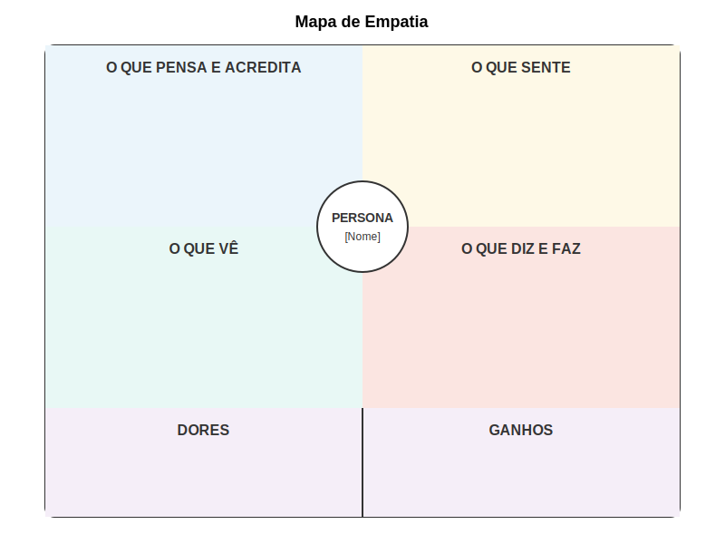

### O que o usuário OUVE?

Este quadrante captura as influências auditivas e informacionais - o que o usuário escuta de colegas, superiores, especialistas e outras fontes de informação. Inclui tanto comunicações diretas quanto mensagens indiretas que moldam sua compreensão.

Para startups deeptech, este quadrante pode revelar:
- Feedback de colegas sobre tecnologias similares
- Recomendações de especialistas ou consultores
- Mensagens de fornecedores e vendedores
- Preocupações expressas por superiores ou subordinados
- Rumores ou histórias sobre sucessos e fracassos tecnológicos

Perguntas exploratórias para este quadrante incluem:
- O que este usuário ouve de seus colegas sobre este tipo de tecnologia?
- Que conselhos recebe de especialistas em seu campo?
- Como seus superiores comunicam prioridades relacionadas a este contexto?
- Que mensagens recebe de fornecedores ou parceiros?
- Quais histórias circulam em sua indústria sobre tecnologias similares?

### O que o usuário DIZ e FAZ?

Este quadrante captura o comportamento observável e as comunicações públicas do usuário - como age, o que diz a outros, e quais comportamentos demonstra consistentemente. Este quadrante frequentemente revela discrepâncias entre comportamentos públicos e pensamentos ou sentimentos privados.

Para startups deeptech, este quadrante pode revelar:
- Como o usuário descreve suas necessidades e desafios para outros
- Ações concretas que toma para resolver problemas atuais
- Comportamentos adaptativos desenvolvidos para contornar limitações
- Discurso público sobre prioridades e valores
- Decisões observáveis sobre adoção de tecnologia

Perguntas exploratórias para este quadrante incluem:
- Como este usuário descreve seus desafios para colegas ou superiores?
- Que ações concretas toma atualmente para resolver o problema?
- Quais adaptações ou workarounds desenvolveu?
- Como se posiciona publicamente em relação a novas tecnologias?
- Que decisões observáveis tomou recentemente neste contexto?

A imagem acima ilustra a estrutura básica do Mapa de Empatia, com seus quatro quadrantes principais organizados ao redor de uma representação do usuário. Esta ferramenta visual facilita a organização e comunicação de insights sobre a perspectiva do usuário.

## Elementos Complementares

Além dos quatro quadrantes principais, versões mais elaboradas do Mapa de Empatia frequentemente incluem elementos complementares que enriquecem a análise:

### DORES e GANHOS

Estes elementos capturam explicitamente os pontos de frustração e as aspirações do usuário:

**Dores:** Frustrações, obstáculos, riscos e desafios que o usuário enfrenta no contexto analisado. Para startups deeptech, isto pode incluir ineficiências em processos atuais, limitações de ferramentas existentes, pressões competitivas ou restrições organizacionais.

**Ganhos:** Benefícios, desejos, necessidades e medidas de sucesso do usuário. Para tecnologias complexas, isto pode incluir tanto ganhos funcionais (como eficiência ou precisão) quanto emocionais (como confiança ou reconhecimento profissional).

### NECESSIDADES

Este elemento sintetiza as necessidades fundamentais identificadas através da análise dos quadrantes, frequentemente expressas como verbos ou declarações de necessidade. Para startups deeptech, estas necessidades devem transcender aspectos puramente técnicos para capturar objetivos humanos fundamentais.

### INSIGHTS

Espaço para registrar descobertas significativas que emergem da análise do mapa como um todo, especialmente padrões, contradições ou oportunidades não óbvias. Estes insights frequentemente se tornam pontos de partida para ideação e desenvolvimento de soluções.

---

← [Anterior](./1.3.2_mapa_empatia_parte1.md) | [Sumário](../../sumario.md) | [Próximo](./1.3.2_mapa_empatia_parte3.md) →