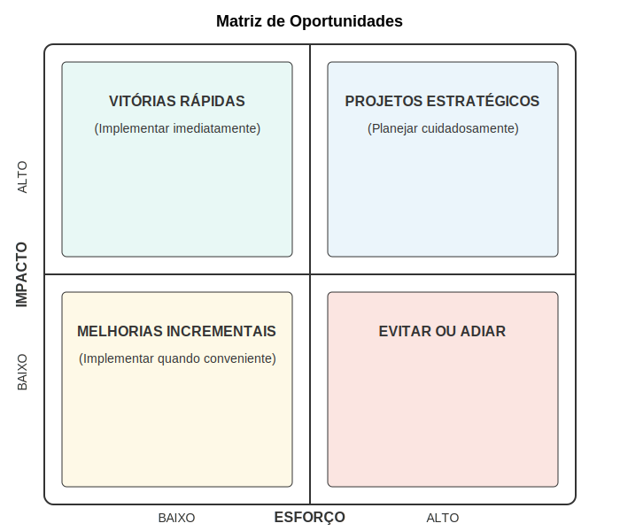

### Processo de Criação de HMWs

Para criar perguntas HMW eficazes a partir de pontos de dor identificados, siga este processo estruturado:

**1. Selecionar pontos de dor prioritários:** Começar com os pontos de dor mais significativos identificados na jornada do usuário.

**2. Extrair o desafio fundamental:** Identificar o problema central por trás do ponto de dor, evitando focar apenas em sintomas superficiais.

**3. Reformular como pergunta:** Transformar o desafio em uma pergunta "Como poderíamos..." que convide à exploração de soluções.

**4. Ajustar o escopo:** Refinar a pergunta para que não seja nem muito ampla (impossível de resolver) nem muito restrita (limitando inovação).

**5. Verificar a formulação positiva:** Garantir que a pergunta foca na oportunidade desejada, não apenas na eliminação do problema.

**6. Testar com a equipe:** Compartilhar as perguntas HMW com a equipe para verificar se inspiram ideias diversas e relevantes.

Exemplo de transformação de ponto de dor em HMW:

- **Ponto de dor original:** "Clientes potenciais têm dificuldade em compreender como nossa tecnologia de IA se traduz em benefícios concretos para seus processos industriais."

- **Desafio fundamental:** Comunicação do valor concreto de tecnologia complexa.

- **HMW inicial:** "Como poderíamos comunicar melhor o valor da nossa tecnologia?"

- **HMW refinado:** "Como poderíamos demonstrar o impacto concreto da nossa IA em processos industriais específicos antes mesmo da implementação completa?"

Este processo transforma um problema potencialmente paralisante em uma oportunidade que energiza a equipe e direciona a criatividade para soluções viáveis e impactantes.

## Oportunidades de Melhoria

As oportunidades de melhoria representam possibilidades específicas para aprimorar a experiência do usuário, seja resolvendo pontos de dor identificados ou criando novos momentos de valor. Para startups deeptech, identificar e priorizar estas oportunidades é crucial para direcionar recursos limitados para onde podem gerar maior impacto.

### Tipos de Oportunidades

As oportunidades de melhoria podem ser categorizadas de diversas formas, cada uma sugerindo diferentes abordagens de solução:

**Oportunidades de simplificação:** Possibilidades de reduzir complexidade, eliminar etapas desnecessárias ou tornar processos mais intuitivos. Em contextos deeptech, estas frequentemente incluem:
- Interfaces que traduzem complexidade técnica em visualizações compreensíveis
- Automação de tarefas repetitivas ou que exigem expertise especializada
- Fluxos de trabalho otimizados que reduzem carga cognitiva

**Oportunidades de integração:** Possibilidades de conectar sistemas, dados ou processos anteriormente separados. Para tecnologias avançadas, estas frequentemente incluem:
- Interoperabilidade com sistemas legados ou ferramentas existentes
- Consolidação de dados de múltiplas fontes em visualizações unificadas
- Eliminação de silos informacionais entre departamentos ou funções

**Oportunidades de capacitação:** Possibilidades de aumentar conhecimento, confiança ou autonomia dos usuários. Em contextos técnicos complexos, estas frequentemente incluem:
- Treinamento contextual integrado ao fluxo de trabalho
- Ferramentas de simulação para prática segura
- Sistemas de recomendação que sugerem próximos passos ou melhores práticas

**Oportunidades de personalização:** Possibilidades de adaptar a experiência às necessidades, preferências ou contextos específicos de diferentes usuários. Para startups deeptech, estas frequentemente incluem:
- Dashboards configuráveis para diferentes perfis de usuário
- Níveis ajustáveis de automação vs. controle manual
- Adaptação a diferentes níveis de expertise técnica

A imagem acima apresenta uma matriz para visualizar e priorizar oportunidades de melhoria, considerando tanto o impacto potencial quanto a viabilidade de implementação. Esta ferramenta ajuda startups deeptech a tomar decisões estratégicas sobre onde focar recursos limitados.

### Identificação de Oportunidades

A identificação de oportunidades de melhoria é um processo criativo que combina análise rigorosa com imaginação:

**Derivação direta de pontos de dor:** Transformar cada ponto de dor identificado em uma oportunidade correspondente. Por exemplo, se um ponto de dor é "dificuldade em interpretar resultados complexos", a oportunidade poderia ser "visualizações intuitivas que traduzem complexidade em insights acionáveis".

**Análise de momentos de verdade:** Identificar momentos críticos na jornada do usuário onde intervenções teriam impacto desproporcional na experiência geral. Para tecnologias complexas, estes frequentemente incluem primeiras impressões, momentos de decisão crítica e experiências de resolução de problemas.

**Benchmarking criativo:** Examinar como desafios similares são resolvidos em outros domínios ou indústrias, buscando inspiração além dos concorrentes diretos. Esta técnica é particularmente valiosa para startups deeptech que frequentemente operam em espaços sem soluções estabelecidas.

**Co-criação com usuários:** Envolver usuários em workshops ou sessões de ideação para identificar oportunidades a partir de sua perspectiva direta. Para tecnologias complexas, combinar usuários com diferentes níveis de expertise técnica pode gerar insights particularmente valiosos.

**Análise de tendências:** Considerar como tendências tecnológicas, comportamentais ou de mercado podem criar novas oportunidades ou tornar viáveis soluções anteriormente impraticáveis.

### Priorização de Oportunidades

Com recursos sempre limitados, a priorização estratégica de oportunidades é essencial:

**Matriz de impacto vs. viabilidade:** Avaliar cada oportunidade considerando tanto seu impacto potencial na experiência do usuário quanto sua viabilidade técnica, organizacional e financeira.

**Alinhamento com diferenciadores estratégicos:** Priorizar oportunidades que reforçam os diferenciadores únicos da startup e sua proposta de valor central.

**Consideração de interdependências:** Identificar oportunidades que desbloqueiam ou potencializam outras, criando efeitos cascata positivos.

**Balanceamento de horizontes temporais:** Combinar "quick wins" que geram valor imediato com investimentos estratégicos de longo prazo.

**Validação com stakeholders:** Verificar prioridades com usuários, investidores e outros stakeholders relevantes para garantir alinhamento com expectativas e necessidades.

Para startups deeptech, esta priorização é particularmente crucial, pois o desenvolvimento de tecnologias avançadas frequentemente envolve trade-offs complexos entre ambição técnica, viabilidade de implementação e necessidades imediatas do mercado.

---

← [Anterior](./1.4.2_pontos_dor_oportunidades_parte2.md) | [Sumário](../../sumario.md) | [Próximo](../../modulo2/2.1_canvas_framework/2.1.1_business_model_canvas_desenvolvimento_de_canvas.md) →