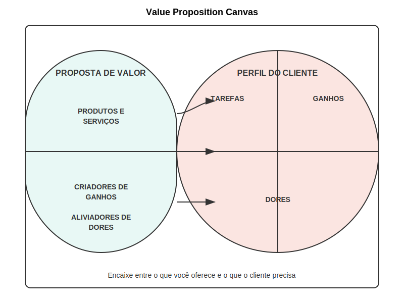

# 2.1.2 Value Proposition Canvas

## Conexão com o Business Model Canvas

O Value Proposition Canvas (VPC) é uma extensão do Business Model Canvas que permite um aprofundamento específico em dois dos blocos mais críticos: a Proposta de Valor e o Segmento de Clientes. Desenvolvido também por Alexander Osterwalder, em colaboração com Yves Pigneur e Alan Smith, esta ferramenta complementar foi criada para ajudar organizações a projetar propostas de valor que efetivamente atendam às necessidades e desejos de seus clientes-alvo.

Enquanto o Business Model Canvas oferece uma visão holística do modelo de negócio completo, o Value Proposition Canvas permite um "zoom" nos elementos centrais que definem a relação entre o que a empresa oferece e o que seus clientes buscam. Esta conexão é particularmente crucial para startups deeptech, onde traduzir capacidades tecnológicas complexas em valor tangível para clientes específicos é frequentemente o maior desafio.

O Value Proposition Canvas se encaixa no Business Model Canvas da seguinte forma:
- O lado direito do VPC (Perfil do Cliente) corresponde e aprofunda o bloco "Segmentos de Clientes" do BMC
- O lado esquerdo do VPC (Mapa de Valor) corresponde e aprofunda o bloco "Proposta de Valor" do BMC
- O "encaixe" (fit) entre estes dois lados representa a conexão efetiva entre estes dois blocos do BMC

Para startups deeptech, esta ferramenta é especialmente valiosa pois:
1. Força uma articulação clara de como capacidades técnicas complexas se traduzem em benefícios específicos
2. Exige compreensão profunda das necessidades reais dos clientes, evitando o desenvolvimento de "soluções em busca de problemas"
3. Facilita a comunicação entre especialistas técnicos e profissionais de negócios ou marketing
4. Permite testar e refinar hipóteses específicas sobre a relação entre tecnologia e valor para o cliente

## Estrutura do Value Proposition Canvas

O Value Proposition Canvas é composto por dois componentes principais que interagem entre si: o Perfil do Cliente (Customer Profile) e o Mapa de Valor (Value Map).

A imagem acima apresenta a estrutura completa do Value Proposition Canvas. Vamos explorar cada componente em detalhe:

### Perfil do Cliente

O Perfil do Cliente representa uma análise estruturada de um segmento específico de clientes, capturando três elementos fundamentais:

#### Jobs-to-be-done (Tarefas a Realizar)

Este elemento captura o que os clientes estão tentando realizar em seu trabalho ou vida. Vai além de funções ou atividades específicas para incluir os objetivos fundamentais que motivam suas ações. Os jobs podem ser:

**Jobs funcionais:** Tarefas práticas e objetivas que os clientes precisam completar.
Exemplo em contexto deeptech: "Prever falhas de equipamentos antes que causem interrupções na produção"

**Jobs sociais:** Relacionados a como os clientes querem ser percebidos por outros.
Exemplo: "Ser reconhecido como líder em inovação tecnológica no setor"

**Jobs emocionais:** Relacionados a estados emocionais que os clientes buscam.
Exemplo: "Sentir confiança nas decisões baseadas em dados complexos"

**Jobs de suporte:** Tarefas auxiliares relacionadas ao consumo ou uso de valor.
Exemplo: "Integrar novas tecnologias aos sistemas legados existentes"

Para startups deeptech, é particularmente importante identificar os jobs fundamentais por trás das necessidades expressas, pois frequentemente a tecnologia pode resolver problemas de formas radicalmente diferentes das soluções existentes.

---

← [Anterior](./2.1.2_value_proposition_canvas_desenvolvimento_de_value_proposition_canvas.md) | [Sumário](../../sumario.md) | [Próximo](./2.1.2_value_proposition_canvas_parte2.md) →