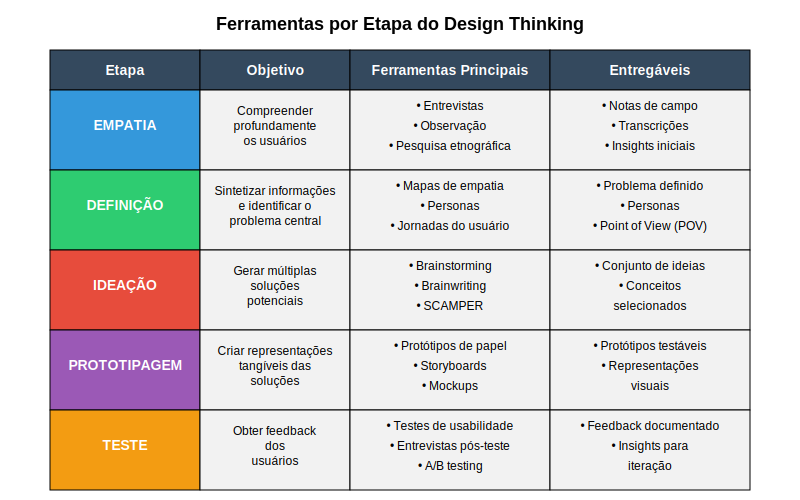

## Exercício Prático: Identificação de Problemas

Para aplicar os aprendizados destes casos, propomos um exercício prático de identificação de problemas utilizando princípios do Design Thinking:

1. Selecione um setor ou área de interesse relacionada à tecnologia profunda (biotecnologia, energia renovável, inteligência artificial, etc.).

2. Realize uma pesquisa exploratória rápida, identificando 3-5 desafios ou frustrações significativas enfrentadas pelos usuários neste setor.

3. Para cada desafio identificado, formule uma declaração de problema no formato "Como poderíamos..." (How Might We).

4. Selecione a declaração que parece oferecer maior potencial de impacto e inovação.

5. Esboce uma abordagem inicial para explorar este problema, indicando:
   - Quem seriam os usuários e stakeholders a serem pesquisados
   - Que técnicas de empatia seriam mais apropriadas
   - Que tipos de protótipos poderiam ser desenvolvidos para testar soluções

Este exercício simula as fases iniciais do Design Thinking e ajuda a desenvolver a mentalidade de identificação de oportunidades centradas no usuário, fundamental para startups deeptech que buscam aplicar sua tecnologia a problemas relevantes do mundo real.

A imagem acima apresenta uma visão geral das principais ferramentas e técnicas utilizadas em cada fase do processo de Design Thinking, servindo como referência prática para a aplicação da metodologia em diferentes contextos, incluindo startups deeptech.

---

← [Anterior](./1.1.2_etapas_design_thinking_parte3.md) | [Sumário](../../sumario.md) | [Próximo](./1.1.3_cases_rapidos_parte1.md) →