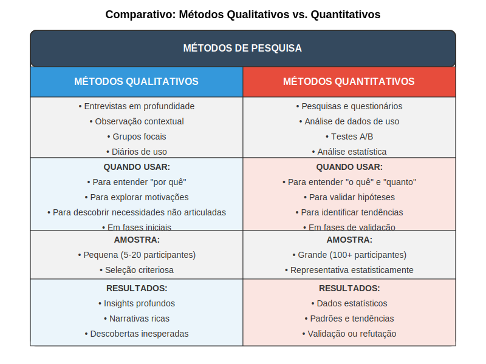

### Mainstream Users (Usuários Convencionais)

Os mainstream users representam a maioria do mercado potencial e tendem a adotar novas tecnologias apenas quando estas já demonstraram claramente seu valor e estabilidade. Estes usuários priorizam confiabilidade, facilidade de uso e conformidade com padrões estabelecidos acima da inovação por si só.

Para startups deeptech, a transição de early adopters para o mercado mainstream representa um desafio crítico conhecido como "atravessar o abismo" (crossing the chasm), conforme descrito por Geoffrey Moore. Esta transição frequentemente exige não apenas refinamentos técnicos no produto, mas também mudanças significativas na comunicação, suporte e modelo de negócios.

Características dos mainstream users:
- Preferência por soluções comprovadas e estáveis
- Valorização da facilidade de uso e integração com sistemas existentes
- Sensibilidade a custos totais de propriedade, incluindo treinamento e manutenção
- Necessidade de suporte abrangente e documentação clara
- Frequentemente tomam decisões baseadas em referências e casos de sucesso

Compreender as diferenças fundamentais entre early adopters e mainstream users é crucial para startups deeptech, pois permite desenvolver estratégias específicas para cada fase do ciclo de vida do produto. O feedback dos early adopters é invaluável para refinar a tecnologia, mas suas preferências e tolerâncias não devem ser generalizadas para o mercado mais amplo.

## Segmentação de Usuários para Deeptech

Além das categorizações gerais discutidas anteriormente, startups deeptech frequentemente precisam desenvolver abordagens de segmentação mais específicas, adaptadas às particularidades de suas tecnologias e mercados potenciais.

### Segmentação por Nível de Expertise Técnica

Em tecnologias complexas, o nível de conhecimento técnico dos usuários pode variar drasticamente e influenciar significativamente suas expectativas, necessidades e comportamentos:

**Especialistas técnicos:** Possuem conhecimento profundo da tecnologia subjacente e frequentemente valorizam controle granular, personalização avançada e acesso a dados detalhados. Para este segmento, simplificação excessiva pode ser percebida como limitante.

**Usuários semi-técnicos:** Compreendem os princípios básicos da tecnologia, mas não necessariamente seus detalhes de implementação. Valorizam interfaces que traduzem conceitos técnicos em termos mais acessíveis, mantendo algum nível de controle sobre parâmetros importantes.

**Usuários não-técnicos:** Focam primariamente nos resultados e benefícios da tecnologia, não em seu funcionamento interno. Valorizam interfaces intuitivas, automação inteligente e comunicação em termos de benefícios práticos.

Para startups deeptech, é comum que os primeiros usuários sejam predominantemente técnicos, mas o crescimento sustentável frequentemente requer adaptar a solução para atender também usuários menos técnicos, sem alienar a base inicial.

### Segmentação por Contexto Organizacional

Em vendas B2B, o contexto organizacional dos usuários pode influenciar significativamente suas necessidades e processos de decisão:

**Organizações inovadoras:** Possuem processos estabelecidos para avaliar e adotar novas tecnologias, frequentemente incluindo equipes dedicadas à inovação. Valorizam potencial transformador e vantagem competitiva.

**Organizações pragmáticas:** Adotam novas tecnologias principalmente para resolver problemas específicos bem definidos. Valorizam ROI claramente demonstrável e mitigação de riscos.

**Organizações conservadoras:** Priorizam estabilidade e conformidade, adotando novas tecnologias apenas quando se tornam padrão de mercado. Valorizam compatibilidade com sistemas existentes e amplo suporte.

Para startups deeptech, identificar organizações com cultura de inovação compatível pode ser tão importante quanto a adequação técnica da solução às necessidades específicas.

A imagem acima apresenta uma matriz comparativa que pode auxiliar na segmentação de usuários para tecnologias deeptech, considerando tanto o nível de expertise técnica quanto a disposição para adotar inovações. Esta ferramenta ajuda a identificar segmentos prioritários e adaptar estratégias de pesquisa, desenvolvimento e comunicação para cada grupo.

## Implicações para Pesquisa e Design

A compreensão dos diferentes tipos de usuários tem implicações diretas para a condução de pesquisas e o processo de design em startups deeptech:

1. **Priorização estratégica:** Recursos limitados exigem foco nos tipos de usuários mais críticos para o estágio atual da startup. Tipicamente, early adopters técnicos são prioritários nos estágios iniciais, com expansão gradual para outros segmentos.

2. **Métodos de pesquisa adaptados:** Diferentes tipos de usuários respondem melhor a diferentes abordagens de pesquisa. Por exemplo, early adopters técnicos frequentemente fornecem feedback detalhado em testes de usabilidade, enquanto usuários mainstream podem requerer métodos mais estruturados.

3. **Balanceamento de necessidades:** O design deve equilibrar as necessidades de diferentes tipos de usuários, criando soluções que satisfaçam requisitos primários sem alienar stakeholders importantes ou criar barreiras para adoção futura por segmentos mainstream.

4. **Evolução do produto:** A estratégia de produto deve antecipar a evolução da base de usuários ao longo do tempo, planejando como a solução se adaptará à medida que se move de early adopters para o mercado mainstream.

5. **Comunicação diferenciada:** Mensagens e materiais de comunicação devem ser adaptados para ressoar com diferentes tipos de usuários, destacando aspectos da solução mais relevantes para cada segmento.

A categorização de usuários não é um exercício estático, mas um processo contínuo que evolui com a maturidade do produto e da empresa. Startups deeptech bem-sucedidas revisitam regularmente suas segmentações, incorporando novos insights à medida que expandem para novos mercados e casos de uso.

---

← [Anterior](./1.2.1_tipos_usuarios_parte2.md) | [Sumário](../../sumario.md) | [Próximo](./1.2.2_metodos_pesquisa_parte1.md) →