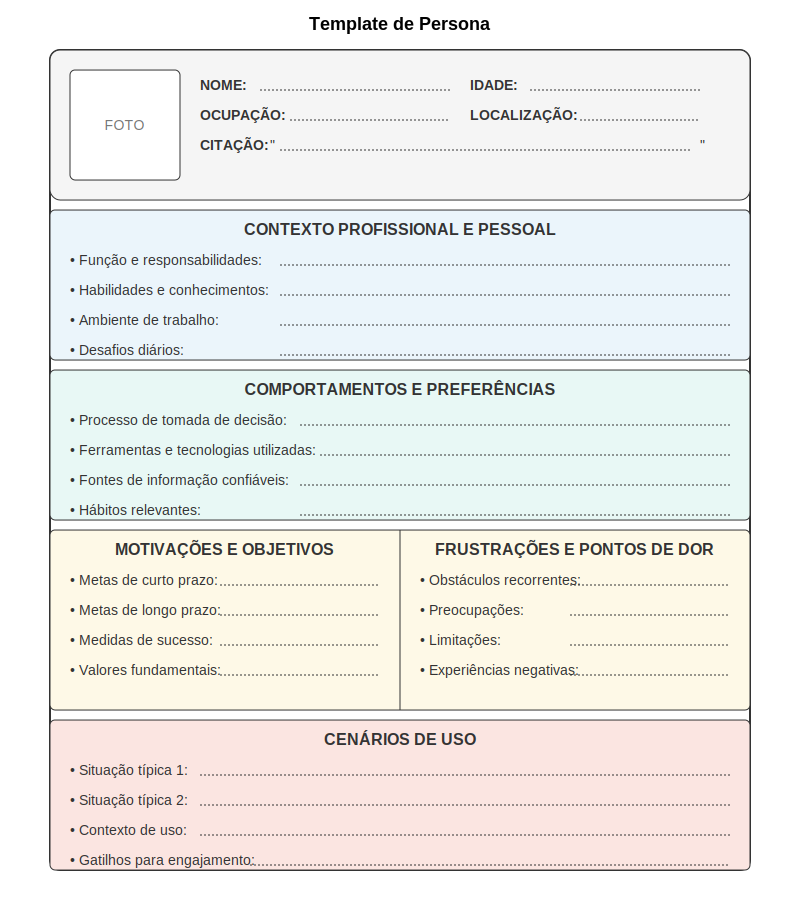

### Elementos Psicológicos e Comportamentais

**Objetivos e motivações:** O que a persona está tentando alcançar, tanto em termos práticos (objetivos funcionais) quanto emocionais (aspirações, desejos). Para startups deeptech, é importante distinguir entre objetivos relacionados à tecnologia em si (ex: "implementar um sistema mais eficiente") e objetivos mais amplos que a tecnologia ajuda a atingir (ex: "reduzir tempo gasto em tarefas administrativas para focar em pesquisa").

**Frustrações e pontos de dor:** Problemas, obstáculos e irritações que a persona enfrenta atualmente, especialmente aqueles que a solução proposta poderia resolver. Estes elementos são cruciais para identificar oportunidades de valor real.

**Comportamentos e hábitos:** Padrões de comportamento observados durante a pesquisa, incluindo preferências, rotinas e estratégias adaptativas. Para tecnologias complexas, é particularmente importante documentar como a persona lida atualmente com desafios similares.

### Elementos Específicos para Contexto Técnico

Para startups deeptech, alguns elementos adicionais podem enriquecer significativamente as personas:

**Nível de expertise técnica:** Avaliação detalhada do conhecimento e experiência da persona com tecnologias relevantes, incluindo áreas específicas de competência e lacunas.

**Atitude frente à tecnologia:** Posicionamento da persona no espectro de adoção de tecnologia (early adopter vs. mainstream), tolerância a riscos e imperfeições, e disposição para aprender novas ferramentas.

**Influenciadores e fontes de informação:** Como a persona toma decisões sobre adoção de novas tecnologias, incluindo fontes confiáveis, processos de validação e stakeholders envolvidos.

**Restrições organizacionais:** Limitações impostas pelo ambiente organizacional, como políticas de segurança, processos de aprovação ou restrições orçamentárias que afetam a adoção de novas tecnologias.

A imagem acima apresenta um template de persona adaptado para o contexto de startups deeptech, incorporando os elementos essenciais discutidos. Este template pode ser utilizado como ponto de partida para o desenvolvimento de personas específicas para seu projeto.

## Processo de Criação Baseado em Dados

A criação de personas eficazes não é um exercício criativo arbitrário, mas um processo rigoroso de síntese baseado em dados reais coletados durante a fase de pesquisa. Um processo estruturado garante que as personas representem fielmente os padrões identificados e sejam ferramentas úteis para decisões de design.

### Coleta de Dados

O primeiro passo é garantir uma base sólida de dados qualitativos e quantitativos sobre os usuários potenciais:

**Dados qualitativos:** Entrevistas em profundidade, observações contextuais, grupos focais e outros métodos que revelam motivações, comportamentos e contextos.

**Dados quantitativos:** Surveys, analytics, dados demográficos e outras métricas que ajudam a identificar padrões e segmentos significativos.

Para startups deeptech, é particularmente valioso combinar insights de usuários potenciais com perspectivas de especialistas do domínio, que podem ajudar a interpretar necessidades técnicas específicas e contextos de uso especializado.

### Identificação de Padrões

Com os dados coletados, o próximo passo é analisar e identificar padrões significativos que sugerem diferentes tipos de usuários:

**Agrupamento por comportamentos:** Em vez de segmentar primariamente por demografia, foque em padrões comportamentais, necessidades e contextos de uso similares.

**Identificação de variáveis diferenciadoras:** Determine quais características realmente distinguem diferentes tipos de usuários de maneira relevante para o design da solução.

**Mapeamento de correlações:** Identifique como diferentes características se relacionam entre si, buscando combinações recorrentes que sugerem arquétipos naturais.

Para tecnologias complexas, variáveis como nível de expertise técnica, contexto organizacional e objetivos primários frequentemente são mais relevantes para segmentação do que características demográficas tradicionais.

---

← [Anterior](./1.3.1_criacao_personas_parte1.md) | [Sumário](../../sumario.md) | [Próximo](./1.3.1_criacao_personas_parte3.md) →