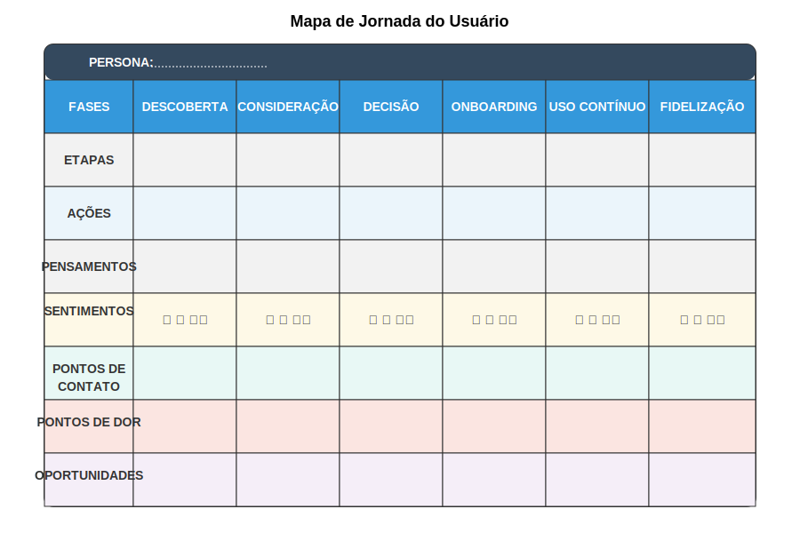

### Pensamentos e Emoções

Além das ações observáveis, o mapa captura a dimensão interna da experiência - o que o usuário pensa e sente em cada fase:

**Pensamentos:** Questões, considerações e raciocínios que ocorrem na mente do usuário.
**Emoções:** Estados emocionais experimentados, que podem variar de positivos (entusiasmo, confiança) a negativos (frustração, ansiedade).

Para startups deeptech, esta dimensão é particularmente importante pois revela aspectos como:
- Preocupações sobre riscos técnicos ou organizacionais
- Pressões internas relacionadas a expectativas de desempenho
- Inseguranças sobre competência técnica para avaliar ou implementar novas tecnologias
- Entusiasmo ou ceticismo sobre promessas tecnológicas

A representação visual das emoções frequentemente utiliza uma "linha emocional" que mostra os altos e baixos da experiência, destacando momentos de particular satisfação ou frustração que podem não ser óbvios apenas observando comportamentos.

### Pontos de Dor e Oportunidades

Com base na análise das ações, pensamentos e emoções, o mapa identifica explicitamente:

**Pontos de dor (pain points):** Momentos de frustração, confusão, atraso ou dificuldade que prejudicam a experiência. Em contextos deeptech, estes frequentemente incluem:
- Complexidade excessiva de informações técnicas
- Dificuldades de integração com sistemas existentes
- Incertezas sobre retorno de investimento
- Resistência organizacional à mudança
- Lacunas de conhecimento técnico necessário

**Oportunidades:** Possibilidades de melhorar a experiência, seja resolvendo pontos de dor ou criando momentos de encantamento. Para startups deeptech, oportunidades típicas incluem:
- Simplificação de conceitos técnicos complexos
- Ferramentas de simulação de ROI
- Programas de implementação faseada
- Suporte especializado em momentos críticos
- Comunidades de usuários para compartilhamento de conhecimento

A identificação clara de pontos de dor e oportunidades transforma o mapa de uma ferramenta puramente analítica em um instrumento estratégico que direciona ações concretas de melhoria.

A imagem acima apresenta um template de Customer Journey Map adaptado para contextos de startups deeptech, incorporando os componentes essenciais discutidos. Este template pode ser personalizado conforme as necessidades específicas de cada projeto.

## Tipos de Jornadas

Existem diferentes tipos de Customer Journey Maps, cada um com propósitos e características específicas:

### Jornada Atual vs. Jornada Futura

**Jornada Atual (As-Is Journey):** Mapeia a experiência tal como existe atualmente, baseada em pesquisa com usuários reais. Este tipo de mapa é fundamental para identificar problemas e oportunidades no estado atual.

**Jornada Futura (To-Be Journey):** Projeta como a experiência deveria ser após implementação de melhorias ou introdução de novas soluções. Este tipo de mapa serve como visão compartilhada e guia para desenvolvimento.

Para startups deeptech, é frequentemente valioso criar ambos os tipos: a jornada atual para compreender profundamente o contexto e desafios existentes, e a jornada futura para articular como a nova tecnologia transformará a experiência.

### Jornada de Alto Nível vs. Jornada Detalhada

**Jornada de Alto Nível:** Oferece visão panorâmica da experiência completa, capturando fases principais e momentos críticos. Útil para comunicação executiva e alinhamento estratégico.

**Jornada Detalhada:** Explora minuciosamente cada fase, documentando todas as ações, pensamentos e pontos de contato. Útil para equipes de implementação e design de interações específicas.

Para startups deeptech, uma abordagem eficaz frequentemente envolve criar primeiro uma jornada de alto nível para estabelecer contexto compartilhado, seguida por jornadas detalhadas para fases particularmente críticas ou complexas.

### Jornada Linear vs. Jornada Cíclica

**Jornada Linear:** Representa experiências com início e fim claramente definidos, como processo de compra ou implementação.

**Jornada Cíclica:** Captura experiências contínuas ou recorrentes, como uso regular de um produto ou ciclos de renovação/upgrade.

Para tecnologias complexas, é frequentemente necessário mapear tanto aspectos lineares (como processo de implementação inicial) quanto cíclicos (como uso contínuo e evolução da adoção ao longo do tempo).

## Processo de Criação

A criação de um Customer Journey Map eficaz requer um processo estruturado que combine rigor analítico com empatia genuína:

### Preparação

**Definição de objetivos:** Clarificar o propósito específico do mapeamento (ex: melhorar processo de onboarding, reduzir abandono, identificar oportunidades de diferenciação).

**Seleção de persona e cenário:** Escolher qual persona será o foco do mapa e definir claramente o cenário específico a ser mapeado.

**Reunião de dados existentes:** Compilar insights de pesquisas anteriores, analytics, feedback de clientes e conhecimento interno relevante.

### Pesquisa

**Entrevistas em profundidade:** Conversar com usuários reais sobre suas experiências completas, explorando não apenas o que fizeram, mas também motivações, expectativas e emoções.

**Observação contextual:** Quando possível, observar usuários navegando a jornada em contexto real, identificando comportamentos e desafios que podem não ser verbalizados.

**Análise de dados quantitativos:** Complementar insights qualitativos com métricas como taxas de conversão, tempo gasto em cada fase, pontos de abandono e padrões de uso.

Para startups deeptech, pode ser particularmente valioso combinar perspectivas de diferentes stakeholders envolvidos na mesma jornada (ex: usuários técnicos, decisores, implementadores) para capturar a complexidade completa da experiência organizacional.

---

← [Anterior](./1.4.1_customer_journey_map_parte2.md) | [Sumário](../../sumario.md) | [Próximo](./1.4.1_customer_journey_map_parte4.md) →