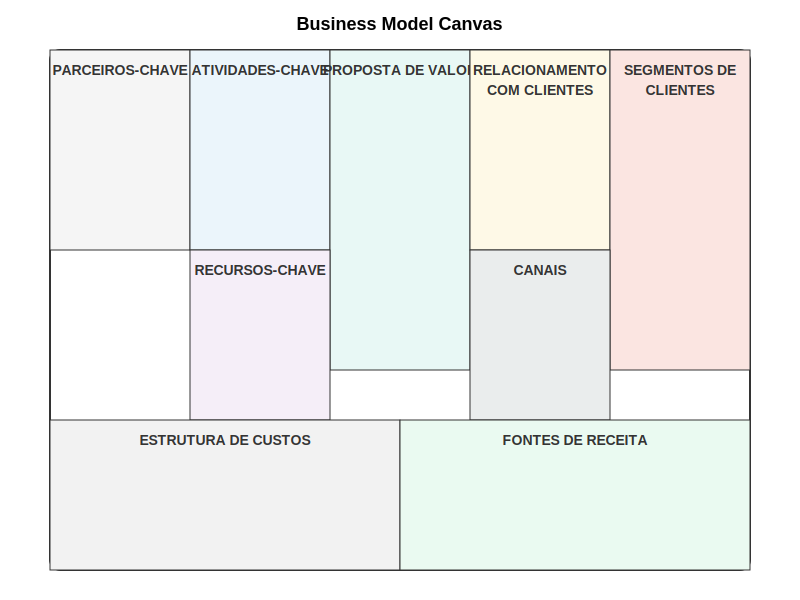

# 2.1.1 Introdução ao Business Model Canvas

## Origem e Propósito

O Business Model Canvas (BMC) é uma ferramenta estratégica poderosa que revolucionou a forma como organizações desenvolvem, documentam e comunicam seus modelos de negócio. Desenvolvido por Alexander Osterwalder e Yves Pigneur, e apresentado no livro "Business Model Generation" (2010), o Canvas surgiu como resposta à necessidade de uma abordagem mais visual, colaborativa e dinâmica para o design de modelos de negócio.

Antes do Canvas, os modelos de negócio eram frequentemente descritos em extensos planos de negócio textuais, que demandavam tempo significativo para criar e atualizar, e raramente eram consultados após sua elaboração inicial. O BMC transformou este paradigma ao oferecer uma representação visual em uma única página que captura todos os elementos essenciais de um modelo de negócio.

Para startups deeptech, o Business Model Canvas é particularmente valioso por diversos motivos:

1. **Tradução de tecnologia em valor:** Ajuda a articular como tecnologias complexas podem ser transformadas em propostas de valor tangíveis para segmentos específicos de clientes.

2. **Visão holística:** Força a consideração não apenas dos aspectos tecnológicos, mas de todos os elementos necessários para criar um negócio viável, desde canais de distribuição até estruturas de custo.

3. **Ferramenta de comunicação:** Facilita a explicação do modelo de negócio para investidores, parceiros e outros stakeholders que podem não ter expertise técnica profunda.

4. **Iteração rápida:** Permite testar e refinar diferentes configurações de modelo de negócio de forma ágil, essencial em ambientes de alta incerteza tecnológica e de mercado.

5. **Alinhamento de equipe:** Cria entendimento compartilhado entre membros com diferentes backgrounds (técnico, negócios, design), essencial para o sucesso de startups deeptech.

O propósito fundamental do Business Model Canvas é permitir que organizações visualizem, analisem e transformem seus modelos de negócio de forma sistemática e colaborativa. Ele serve como uma linguagem comum que facilita discussões estratégicas e tomadas de decisão baseadas em uma compreensão compartilhada de como a organização cria, entrega e captura valor.

## Visão Geral dos 9 Blocos

O Business Model Canvas é estruturado em nove blocos interconectados que representam os elementos fundamentais de qualquer modelo de negócio. Estes blocos são organizados visualmente para refletir o fluxo lógico de como o valor é criado e entregue aos clientes, e como a organização captura parte deste valor como receita.

A imagem acima apresenta a estrutura completa do Business Model Canvas com seus nove blocos. Vamos explorar cada um deles:

### 1. Segmentos de Clientes

Este bloco define os diferentes grupos de pessoas ou organizações que a empresa busca alcançar e servir. É o ponto de partida fundamental, pois todas as outras decisões do modelo de negócio devem ser orientadas pelas necessidades específicas destes segmentos.

Para startups deeptech, a segmentação precisa é particularmente crucial, pois tecnologias avançadas frequentemente têm aplicações em múltiplos setores, mas recursos limitados exigem foco inicial em segmentos específicos onde a tecnologia pode gerar maior valor diferenciado.

Exemplos de segmentação em contexto deeptech:
- Indústrias específicas (manufatura, saúde, energia)
- Tamanho de organização (grandes corporações vs. médias empresas)
- Maturidade tecnológica (early adopters vs. mainstream)
- Posição na cadeia de valor (OEMs, integradores, usuários finais)

### 2. Proposta de Valor

Este bloco descreve o pacote de produtos e serviços que criam valor para um segmento específico de clientes, resolvendo seus problemas ou satisfazendo suas necessidades. É o motivo pelo qual os clientes escolhem uma empresa em vez de outra.

Para startups deeptech, articular claramente a proposta de valor é um desafio particular, pois envolve traduzir capacidades tecnológicas complexas em benefícios tangíveis e compreensíveis. É essencial ir além de especificações técnicas para comunicar o impacto real na vida ou operações dos clientes.

---

← [Anterior](./2.1.1_business_model_canvas_desenvolvimento_de_canvas.md) | [Sumário](../../sumario.md) | [Próximo](./2.1.1_business_model_canvas_parte2.md) →